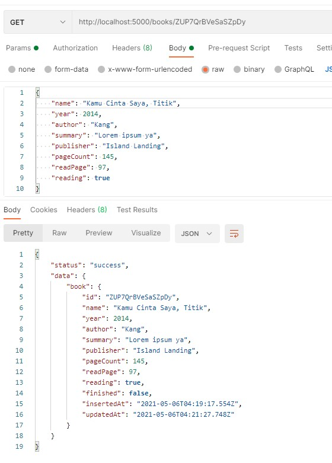
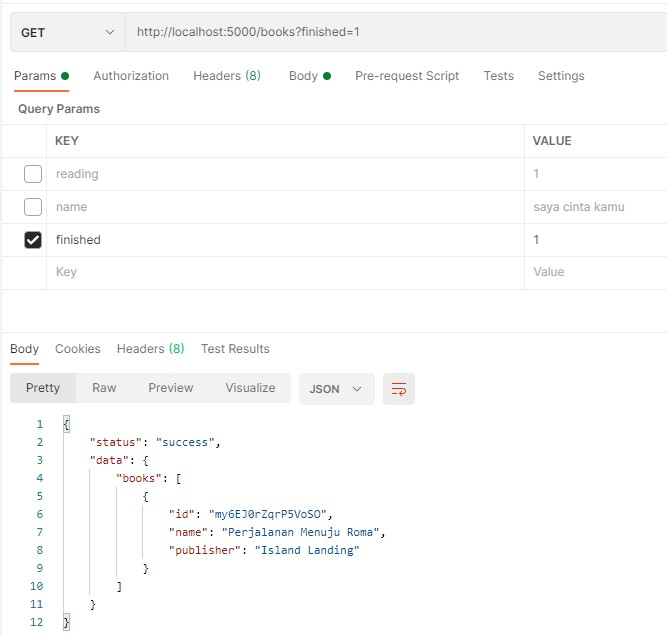
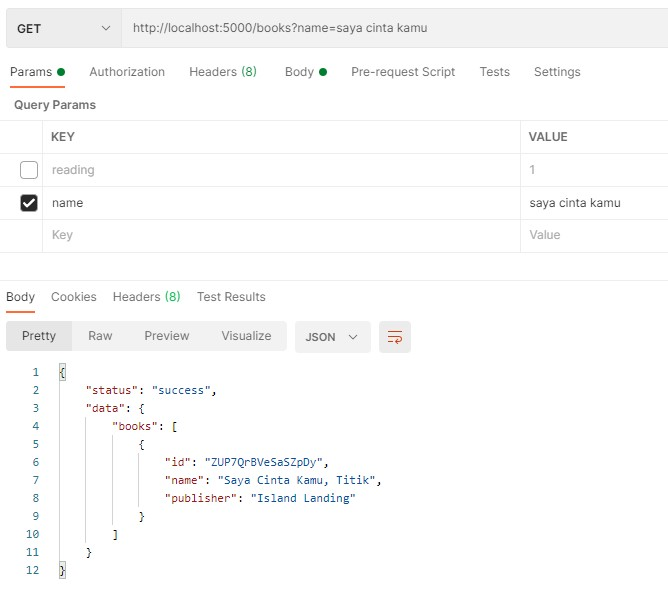
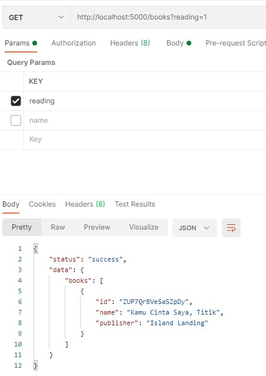
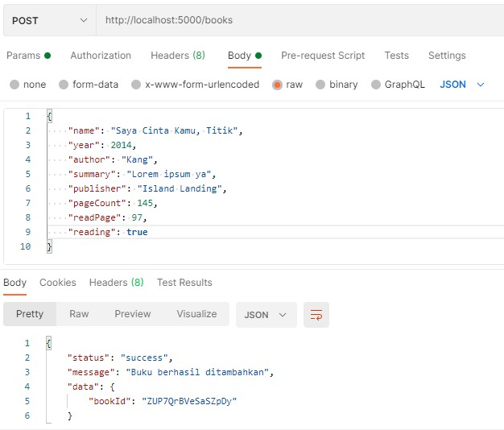
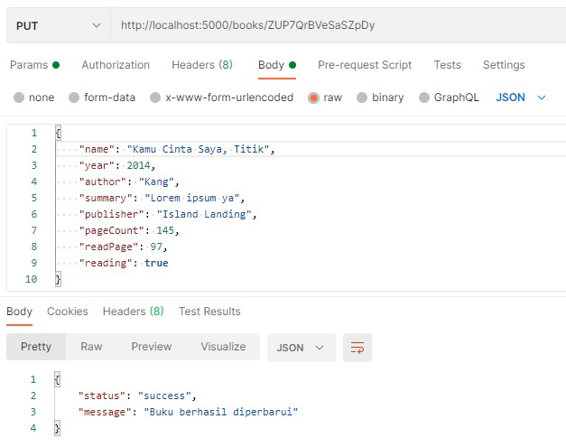
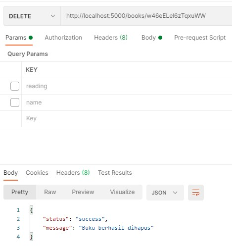

# Bookshelf API
Bookshelf App merupakan aplikasi Back-End yang memuat list buku dari API. Repository ini merupakan hasil Submission Bookshelf API dari kelas Belajar Membuat Aplikasi Back-End untuk Pemula oleh Dicoding.
# GET Method

# POST Method

# PUT Method

# DELETE Method

